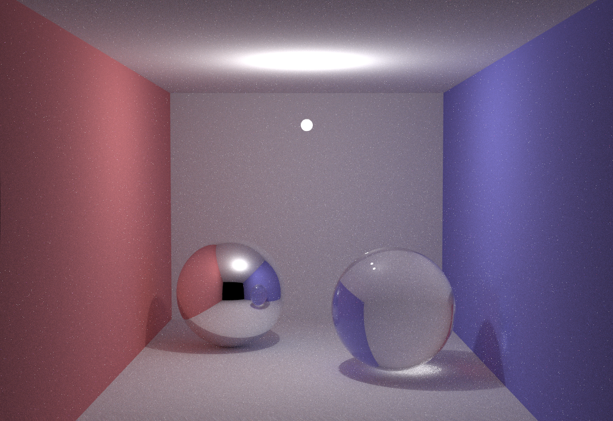

Global-Illumination
===================

Global Illumination

How to compile the program?
-------------------

* For Linux/Mac OS users:
	- Make sure you have g++ compiler installed
	- Open your command.
	- cd to source/SimplePT
	- Type: make
	- In the same folder. You will get a binary file naned "3"
	- Type: ./3 20
		 (It means take 20 samples for each sub-pixel)
	- Wait for some minutes, until the image is 100% rendered
	- There will be an image.ppm file. You can open it.

* For Windows Users:
	- Open the solution in Visual Studio 
	- Set to Release build mode. Then build it.
	- Run it. 
	- You can get a result( image.ppm ), but you might not be able to open it.
	- There is an online image converter here: http://www.sciweavers.org/free-online-image-converter 
	- Convert the .ppm file, then you can see the image.

Have fun!

Demo
-------------------
This is a screenshot of the rendering result:

